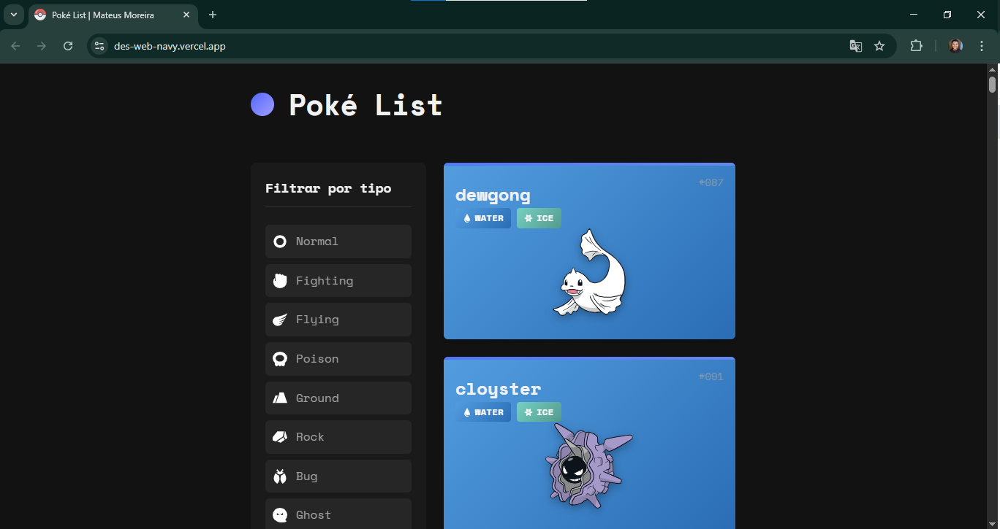
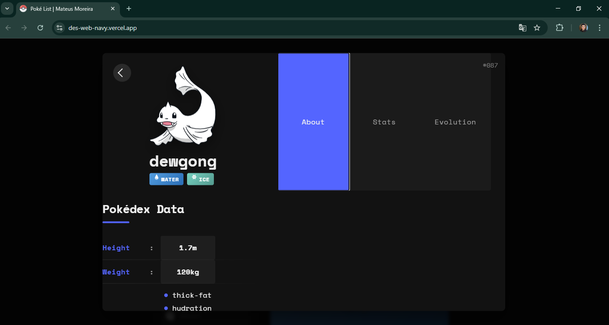
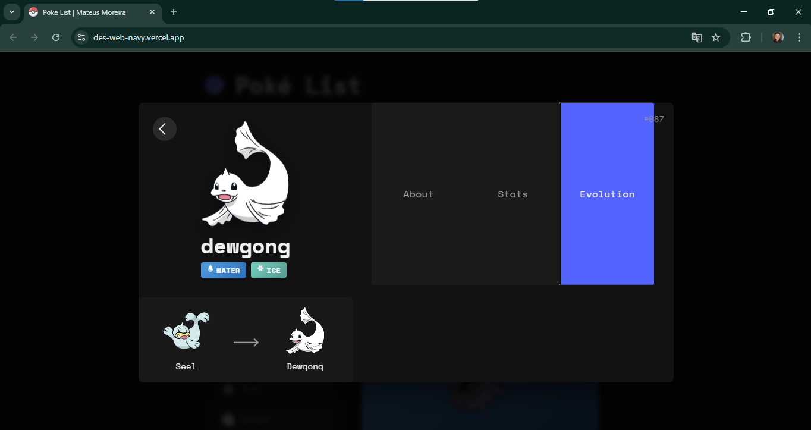

# Pokédex React App

Este projeto é uma **Pokédex interativa** desenvolvida em **React**, onde os usuários podem explorar informações sobre Pokémon. Utilizando dados da [PokéAPI](https://pokeapi.co/), a aplicação permite filtrar Pokémon por tipo, visualizar estatísticas detalhadas, ver suas evoluções e muito mais, tudo com uma interface simples e responsiva.

## 🌐 Acesse Online

Experimente a aplicação ao vivo: [Pokédex Live](https://des-web-navy.vercel.app/)

## 📸 Capturas de Tela

| Página Inicial | Informações do Pokémon | Gráficos de Estatísticas |
| :------------: | :--------------------: | :----------------------: |
|  |  |  |

## ✨ Funcionalidades

- **Filtro por Tipo**: Filtre facilmente Pokémon por tipo.
- **Modal Informativo**: Cada Pokémon possui um modal com informações detalhadas.
  - **Sobre**: Dados básicos como altura, peso, habilidades e tipos.
  - **Estatísticas**: Representação visual dos atributos básicos.
  - **Evolução**: Exibição da cadeia evolutiva.
- **Design Responsivo**: O layout se adapta a diferentes tamanhos de tela, funcionando bem em dispositivos móveis e desktops.
- **Busca de Dados Otimizada**: Utilização do **React Query** para melhorar o desempenho com cache e controle de estado de carregamento.
- **Design Inspirado em Dribbble**: A interface foi inspirada pelo trabalho de [Flavio Farias no Dribbble](https://dribbble.com/shots/11114913-Pok-dex-App).

## 🛠️ Tecnologias Utilizadas

- **React**: Biblioteca para construção da interface de usuário.
- **React Query**: Para gerenciamento de dados assíncronos.
- **Vite**: Ferramenta de build e servidor de desenvolvimento.
- **Radix UI**: Componentes de UI acessíveis e modulares.
- **CSS**: Estilização personalizada com CSS puro.
- **Jest**: Framework de testes para garantir a qualidade do código.
- **PokéAPI**: API usada para obter dados de Pokémon.

## 🚀 Como Rodar o Projeto

### Pré-requisitos

Certifique-se de que você tem as seguintes ferramentas instaladas em seu ambiente:

- **Node.js** (versão 14 ou superior)
- **npm** (versão 6 ou superior) ou **yarn**

# Passos para Clonar o Repositório

1. Abra o terminal e execute o comando abaixo para clonar o repositório:

   git clone https://github.com/MateusMoreira1/DES.WEB.git

2. Acesse o diretório do projeto:

   cd DES.WEB

3. Instale as dependências necessárias:

   npm install

4. Inicie o servidor de desenvolvimento:

   npm run dev

5. Abra o navegador e vá para http://localhost:5173 para visualizar a aplicação localmente.

# Scripts para rodar a aplicação

npm run dev:      Inicia o servidor de desenvolvimento.
npm run build:    Cria os arquivos para produção.
npm run preview:  Simula o ambiente de produção localmente.
npm run test:     Executa a suíte de testes.

# Estrutura do projeto

src/
├── components/       # Componentes reutilizáveis (modais, abas, etc.)
├── context/           # Contextos globais do React
├── hooks/             # Hooks personalizados
│   └── __tests__/     # Testes de hooks
├── utils/             # Funções auxiliares
├── App.jsx            # Componente principal da aplicação
├── App.css            # Estilos globais
└── main.jsx           # Ponto de entrada da aplicação
